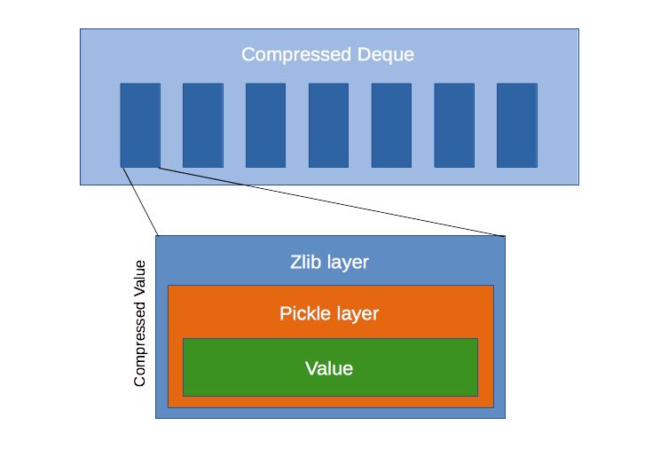
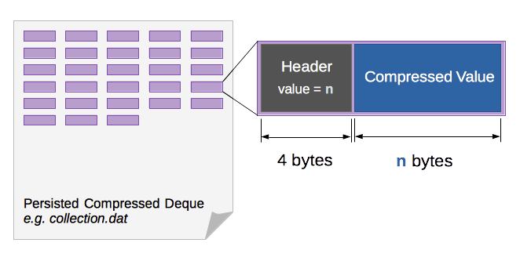

Compressed Deque
================

A deque which compresses its items for a decreased volatile and persistent memory footprint.

Installation
------------

.. code-block:: bash

    $ pip install compressed-deque

How to Use it
-------------

.. code-block:: python

    from compdeque import CompressedDeque

    # Instantiate the Deque
    collection = CompressedDeque()

    # Use it as a normal deque
    collection.append(1)

    # Persist to a file
    CompressedDeque.save_to_file(collection, file_path="/path/to/collection.dat")

    # ...

    # and load it when you need it later
    loaded_collection = CompressedDeque.load_from_file("/path/to/collection.dat")

Tests and documentation
-----------------------

On the project's root folder:

.. code-block:: bash

    # Run all tests
    $ make test

    # Generate documentation
    $ make docs

Structure
---------

Compressed Deque inherits from `deque <https://docs.python.org/2/library/collections.html#collections.deque>`_ and stores its items as zlib compressed pickles. The middle pickle layer only serves as a generic serialization method which can provide a serialized object string for zlib to compress. Although pickle can compress objects, its compression rate does not match zlib's, even using `higher protocols <https://docs.python.org/2/library/pickle.html#data-stream-format>`_.

``save_to_file()`` and ``load_from_file()`` static methods are provided to persist the collection directly into disk in its compressed representation, without much overhead.

The persisted file contains a sequence of header/compressed_value pairs: the header is a 4 byte integer description of the compressed value's length and the compressed value is similiar to its in-memory representation.

